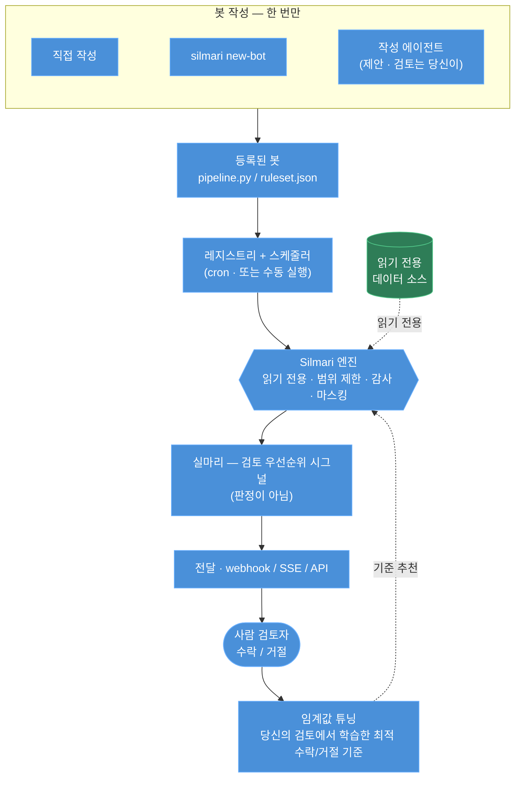

# Silmari (실마리)

[](https://www.gnu.org/licenses/agpl-3.0)

[English](README.md) · **한국어**

**읽기 전용 데이터 소스 위에 규칙을 정의하면, Silmari가 안전하게 _실마리_ — 사람이 판단할
검토 우선순위 단서(시그널) — 를 도출합니다.**

*실마리* = 무언가를 풀어내기 위해 잡아당기는 첫 단서, 풀린 실의 끝. Silmari가 드러내는 것이
바로 그것입니다 — 사람이 살펴볼 가치가 있는 단서들이지, 결코 최종 판정이 아닙니다.

대부분의 "text-to-SQL" / DB 에이전트 도구는 모델이 데이터베이스에 **쓰기**를 허용하고, 데이터를
모델로 전송하며, 감사 기록을 남기지 않습니다. Silmari는 **기본적으로 안전합니다**:

- **읽기 전용(Read-only)** — SQL을 (sqlglot으로) 파싱하여 순수 `SELECT`가 아니면 거부합니다.
  읽기 전용 DB 역할을 지정하거나 백엔드를 읽기 전용으로 열면 데이터베이스 차원에서 강제되는
  강력한 보장을 얻습니다.
- **범위 제한(Scoped)** — 봇/규칙은 자신이 선언한 테이블만 읽을 수 있습니다(문자열 부분 일치가
  아니라 파스 트리에서 해석됨).
- **감사(Audited)** — 모든 접근은 메타데이터만 담긴 감사 레코드를 기록합니다(거부된 시도 포함).
- **마스킹(Redacted)** — `local/*` 모델만 민감 데이터 필터를 건너뛰며, 그 외 모든 모델 호출은
  먼저 마스킹됩니다.
- **사람이 개입(Human-in-the-loop)** — 결과물은 검토 우선순위 *시그널*(실마리)이며, 결코 자동
  적용되지 않습니다.

> Silmari는 **샌드박스가 아니라 심층 방어(defense-in-depth)** 입니다. 솔직한 위협 모델은
> [`SECURITY.md`](SECURITY.md)를 참고하세요(최소 권한 DB 역할을 사용하세요; HTTP API는 인증이
> 없습니다; 작성 에이전트는 제안된 코드를 실행합니다).

## 동작 방식



**봇은 한 번만 작성합니다** — `manifest.yaml` + `pipeline.py` / `ruleset.json`을 직접 작성하거나,
`silmari new-bot`으로 골격을 생성하거나, **로컬 전용 작성 에이전트**가 읽기 전용 소스를 탐색해
검증된 봇을 *제안*하면 당신이 검토합니다. 등록되면 **스케줄러**가 cron으로(또는 수동 트리거로)
실행하며, 매 실행은 읽기 전용 · 범위 제한 · 감사로 동작해 **실마리**(검토 우선순위 시그널,
판정이 아님)를 도출하고 이를 전달하며, 검토자의 수락/거절 결정은 **임계값 튜닝**으로 다음 실행에
반영됩니다.

> 에이전트를 바로 체험: `silmari serve --ui --demo-data`는 레퍼런스 UI의 **"author a bot"**
> 메뉴에서 오프라인·스크립트 기반 작성 데모를 제공합니다(설치할 모델 불필요).

## 두 개의 패키지

- **`silmari-core`** — 거버넌스 라이브러리: LLM 에이전트를 위한 안전하고 읽기 전용이며 범위가
  제한되고 감사·마스킹되는 데이터 접근(sqlglot 가드, DB 레벨 읽기 전용 DuckDB / SQLite / Postgres
  어댑터, 감사, 마스킹, 로컬 우선 LLM 게이트). 어떤 스택에도 넣을 수 있습니다.
- **`silmari-runtime`** — core 위에 올린 올인원 프레임워크: 봇 레지스트리 + 스케줄러,
  Signal(실마리) 모델(시그널과 `kind: prediction` 확률값), 선언적 **ruleset 엔진**,
  전달(이벤트 버스 / webhook / SSE), 사람 **검토 루프 + 임계값 튜닝**, 그리고 FastAPI 앱 — 읽기
  전용 **데이터 브라우저**(`/v1/data`)와 로컬 전용 **작성 에이전트** 포함.

## 설치

```bash
# PyPI에서 (각 패키지는 독립적으로 설치 가능)
pip install silmari-core          # 거버넌스 라이브러리만
pip install 'silmari-core[postgres]'  # + Postgres 어댑터 (psycopg)
pip install silmari-runtime       # 전체 프레임워크 (core에 의존)

# 소스에서 (uv 워크스페이스)
git clone https://github.com/douinc/silmari && cd silmari
uv sync
uv run pytest -q
```

Python 3.14+ 필요.

## 빠른 시작

```bash
# 지금 바로 — 자체 완결형, 합성 데이터, 설정 불필요:
uv run silmari demo                       # 합성 데이터 위 규칙 -> 검토 우선순위 시그널
uv run silmari serve --ui --demo-data     # API + http://localhost:8000 레퍼런스 UI (시드 데이터)

# 직접 봇 만들기:
uv run silmari new-bot my-bot             # ./bots/my-bot 골격 생성 — 템플릿; pipeline.py 편집
uv run silmari run my-bot --source duckdb:///your.duckdb   # 그다음 자신의 데이터에 대해 실행
```

거버넌스 라이브러리(`silmari-core`):

```python
from silmari_core import DataAccess, connect

src = connect("duckdb:///data.duckdb")                 # 읽기 전용으로 열림
src.query("SELECT * FROM orders WHERE total > 100")    # OK (감사됨)
src.query("DROP TABLE orders")                         # ReadOnlyViolation 발생
src.scoped(DataAccess(tables=["orders"])).query("SELECT * FROM customers")  # ScopeViolation 발생
```

봇은 `manifest.yaml`(선언된 테이블 범위, 스케줄) + `pipeline.py`로 구성됩니다:

```python
from silmari_runtime.context import BotResult, Context
from silmari_runtime.signal import result, signal


def run(context: Context) -> BotResult:
    rows = context.source.query("SELECT id, total FROM orders")
    flagged = [
        signal(target_id=str(r["id"]), label="high_value", score=min(1.0, r["total"] / 100))
        for r in rows
        if r["total"] >= 75
    ]
    return result(flagged, label="high_value", as_of=context.as_of)
```

…또는 Python을 아예 건너뛰고 선언적 **ruleset**(`ruleset.json`)을 사용하세요: 컬럼에 대한 AND/OR
조건(`eq/ne/lt/lte/gt/gte/in/text_present/relative_decrease`) → 시그널.
[`examples/bots/`](examples/bots)를 참고하세요.

## 문서

- [`docs/architecture.md`](docs/architecture.md) — 두 패키지, 레이어, 그리고 봇 생명주기.
- [`docs/spec.md`](docs/spec.md) — 설계 명세와 계약(contract).
- [`SECURITY.md`](SECURITY.md) — 안전 모델과 책임 있는 사용.
- [`CONTRIBUTING.md`](CONTRIBUTING.md) — 개발 환경 설정과 지켜야 할 안전 불변식.

## 상태

온프레미스 데이터 인텔리전스 플랫폼에서 범용 엔진으로 추출되었습니다. core, runtime, ruleset
엔진, 전달/검토 API, 작성 에이전트가 구현·테스트되었습니다(오프라인).

## 라이선스

AGPL-3.0-or-later — [`LICENSE`](LICENSE)와 [`NOTICE`](NOTICE)를 참고하세요. Copyright 2026 Dou Inc.
