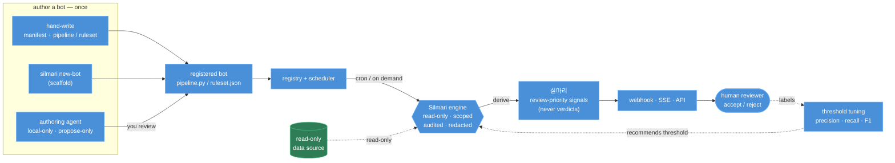

# Silmari (실마리)

[](https://www.gnu.org/licenses/agpl-3.0)

**Define rules over a read-only data source; Silmari safely derives _실마리_ — review-priority
leads (signals) — for a human to decide.**

*실마리* = a clue / the loose thread you pull to unravel something. That is exactly what Silmari
surfaces: the leads worth a human's attention — never a verdict.

Most "text-to-SQL" / DB-agent tools let a model **write** to your database, send your data to the
model, and keep no audit trail. Silmari is **safe by default**:

- **Read-only** — SQL is parsed (sqlglot) and rejected unless it is a pure `SELECT`; point it at a
  read-only DB role / open the backend read-only for a hard, database-enforced guarantee.
- **Scoped** — a bot/rule may only read the tables it declares (resolved from the parse tree, not
  substring matching).
- **Audited** — every access writes a metadata-only audit row (incl. denied attempts).
- **Redacted** — only `local/*` models skip the sensitive-data filter; any other model call is
  redacted first.
- **Human-in-the-loop** — outputs are review-priority *signals* (실마리), never auto-applied.

> Silmari is **defense-in-depth, not a sandbox.** Read [`SECURITY.md`](SECURITY.md) for the honest
> threat model (use a least-privilege DB role; the HTTP API is unauthenticated; the authoring agent
> runs proposed code).

## How it works



A **bot is authored once** — hand-write a `manifest.yaml` + `pipeline.py` / `ruleset.json`, scaffold
one with `silmari new-bot`, or let the **local-only authoring agent** explore the read-only source
and *propose* a validated bot for you to review. Once registered, the **scheduler** runs it on a
cron (or you trigger it on demand); each run executes read-only · scoped · audited, derives **실마리**
(review-priority signals, never verdicts), delivers them, and a reviewer's accept/reject decisions
feed **threshold tuning** back into the next run.

## Two packages

- **`silmari-core`** — the governance library: safe, read-only, scoped, audited, redacted data
  access for LLM agents (sqlglot guard, DB-level read-only DuckDB / SQLite / Postgres adapters,
  audit, masking, local-first LLM gate). Drop it into any stack.
- **`silmari-runtime`** — batteries-included framework on top of core: bot registry + scheduler,
  the Signal (실마리) model (signals and `kind: prediction` probabilities), a declarative **ruleset
  engine**, delivery (event bus / webhooks / SSE), a human **review loop + threshold tuning**, and a
  FastAPI app — with a read-only **data browser** (`/v1/data`) and a local-only **authoring agent**.

## Install

```bash
# from PyPI (each package is independently installable)
pip install silmari-core          # just the governance library
pip install 'silmari-core[postgres]'  # + the Postgres adapter (psycopg)
pip install silmari-runtime       # the full framework (depends on core)

# from source (uv workspace)
git clone https://github.com/douinc/silmari && cd silmari
uv sync
uv run pytest -q
```

Python 3.14+.

## Quickstart

```bash
# try it now — self-contained, synthetic data, no setup:
uv run silmari demo                       # rules over synthetic data -> review-priority signals
uv run silmari serve --ui --demo-data     # API + a reference UI at http://localhost:8000 (seeded)

# build your own bot:
uv run silmari new-bot my-bot             # scaffold ./bots/my-bot — a template; edit pipeline.py
uv run silmari run my-bot --source duckdb:///your.duckdb   # then run it against your own data
```

Governance library (`silmari-core`):

```python
from silmari_core import DataAccess, connect

src = connect("duckdb:///data.duckdb")                 # opened read-only
src.query("SELECT * FROM orders WHERE total > 100")    # OK (audited)
src.query("DROP TABLE orders")                         # raises ReadOnlyViolation
src.scoped(DataAccess(tables=["orders"])).query("SELECT * FROM customers")  # raises ScopeViolation
```

A bot is a `manifest.yaml` (its declared table scope, schedule) + a `pipeline.py`:

```python
from silmari_runtime.context import BotResult, Context
from silmari_runtime.signal import result, signal


def run(context: Context) -> BotResult:
    rows = context.source.query("SELECT id, total FROM orders")
    flagged = [
        signal(target_id=str(r["id"]), label="high_value", score=min(1.0, r["total"] / 100))
        for r in rows
        if r["total"] >= 75
    ]
    return result(flagged, label="high_value", as_of=context.as_of)
```

…or skip Python entirely with a declarative **ruleset** (`ruleset.json`): AND/OR criteria
(`eq/ne/lt/lte/gt/gte/in/text_present/relative_decrease`) over your columns → signals. See
[`examples/bots/`](examples/bots).

## Documentation

- [`docs/architecture.md`](docs/architecture.md) — the two packages, layers, and the bot lifecycle.
- [`docs/spec.md`](docs/spec.md) — the design spec and contracts.
- [`SECURITY.md`](SECURITY.md) — the safety model and responsible use.
- [`CONTRIBUTING.md`](CONTRIBUTING.md) — dev setup and the safety invariants to preserve.

## Status

Extracted as the generic engine from an on-premise data-intelligence platform. The core, runtime,
ruleset engine, delivery/review API, and authoring agent are implemented and tested (offline).

## License

AGPL-3.0-or-later — see [`LICENSE`](LICENSE) and [`NOTICE`](NOTICE). Copyright 2026 Dou Inc.
