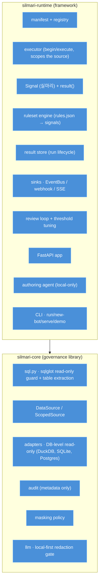

# Architecture

Silmari is two installable packages: a governance **library** (`silmari-core`) and a framework
(`silmari-runtime`) built on it. The runtime depends on core; core has no dependency on the runtime.



## `silmari-core` — the safety primitives

Every guarantee is enforced in the base class, so no adapter can bypass it:

- **`sql.py`** — `assert_read_only` (rejects anything that is not a single pure `SELECT`, including
  write/DDL nested in subqueries/CTEs and multi-statement SQL) and `tables_referenced` (extracts the
  real tables from the parse tree — CTEs/aliases excluded, comments/strings ignored).
- **`source.py`** — `DataSource` (ABC) implements `query/sample/stats/schema/scoped` on top of two
  adapter methods (`_execute/_schema`); the read-only guard and the audit write live here.
  `ScopedSource` rejects any query that reads a table outside the declared `DataAccess` allowlist.
- **`adapters/`** — `DuckDBSource` (`read_only=True`, external file access off by default),
  `SQLiteSource` (`mode=ro` + `PRAGMA query_only`), and `PostgresSource` (session
  `default_transaction_read_only`; pair with a read-only role): the engine physically rejects
  writes. `connect()` dispatches by URL; psycopg ships as an optional `postgres` extra.
- **`audit.py`** — append-only, metadata-only audit (kind, target, row count, duration, outcome).
- **`masking.py`** — configurable direct-identifier masking applied to sampled/queried rows.
- **`sensitive.py` / `llm.py`** — a redaction floor + a `LLMClient` whose gate redacts every message
  for any non-`local/*` model before the call.

## `silmari-runtime` — the framework

- **`manifest.py` / `registry.py`** — a bot is `manifest.yaml` (declared `data_access.tables`,
  trigger, kind, sinks) + `pipeline.py`; the registry loads them (one broken bot doesn't break the
  rest).
- **`signal.py` / `prediction.py`** — the `Signal` (실마리) record + `signal()` / `result()` builders,
  plus `prediction()` / `prediction_result()` for `kind: prediction` (a probability in [0, 1] →
  confidence band); every record carries the not-a-verdict note; generic `target_id` + `subject`.
- **`context.py` / `executor.py`** — the executor scopes the source to the manifest's tables, builds
  the `Context`, runs `run(context) -> BotResult`, persists the result, and publishes lifecycle
  events. `run_bot` (inline) and `start_run` (daemon thread).
- **`ruleset.py` / `proposals.py`** — a declarative ruleset engine (no Python) and a
  stage→validate→approve flow for editing rulesets.
- **`store.py`** — run lifecycle (running/completed/failed) + persisted signals.
- **`sinks.py`** — an in-process `EventBus` (drives SSE) + webhook subscriptions.
- **`review.py`** — per-case accept/reject decisions + threshold tuning (precision/recall/F1).
- **`api/`** — a FastAPI app (results, runs + SSE, review, subscriptions, admin, and a read-only
  data browser at `/v1/data`), via `create_app`.
- **`agent/`** — a local-only tool-use loop that explores the read-only source and proposes a
  validated bot (`register_bot`).
- **`scaffold.py` / `cli.py`** — `silmari new-bot/run/serve/demo`.

## Bot lifecycle

```
author a bot (manual, scaffold, or the agent)
  → registry loads manifest + pipeline
  → executor opens the source scoped to manifest.data_access.tables (read-only, audited)
  → run(context) emits review-priority Signals (실마리), never verdicts
  → result store persists the run; EventBus/webhooks deliver; SSE streams lifecycle events
  → a human reviews each case (accept/reject); tuning recommends a score threshold
```

## Safety invariants

1. **Read-only** — the only writes Silmari makes are to its own audit/result/review stores, never to
   the data source.
2. **Scoped** — a bot reads only its declared tables (fail-closed: no declared scope ⇒ the run is
   rejected unless `data_access.unscoped: true`).
3. **Signals, not verdicts** — every emitted record carries the not-a-verdict note; nothing is
   auto-applied.
4. **Audited** — every access (including denied ones) is recorded, metadata only.
5. **Local-first** — source data only leaves to a model named `local/*`; any other model call is
   redacted first.

See [`SECURITY.md`](../SECURITY.md) for what these do and do **not** guarantee.
