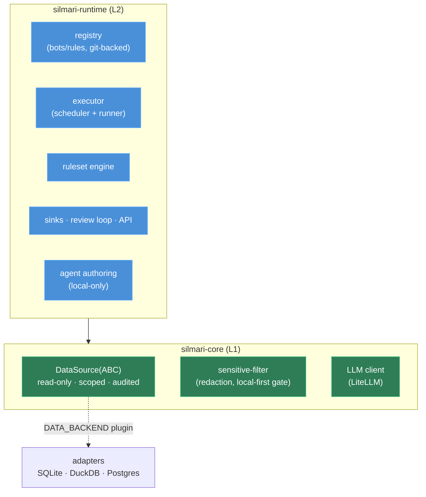

# Silmari — Implementation Spec

*Status: v0.1 · Name: Silmari (실마리) · License: AGPL-3.0-or-later*

This is the spec for Silmari, a governance-first engine that **derives review-priority signals
(실마리) from rules over a read-only data source**. It was extracted as the generic engine from an
on-premise data-intelligence platform; all domain content (rules, data, deployment) is out of scope
and stays private.

---

## 1. What Silmari is

**You define rules; Silmari safely derives 실마리 (leads/signals) for a human to decide.**

- The unit of value is the **실마리 record** — a review-priority *signal*, never a verdict. The
  product is named after its output.
- Two layers:
  - **`silmari-core` (L1)** — governance library: read-only, scoped, audited, redacted data
    access for LLM agents.
  - **`silmari-runtime` (L2)** — framework on top: rule/bot registry, scheduler, agent
    authoring, sinks, review loop, API.

### Principles
1. **Read-only by default.** No write path to the data source — enforced in code *and* at the DB.
2. **Scoped.** A bot/rule reads only the tables it declares.
3. **Audited.** Every access is logged (metadata only, never raw data).
4. **PII stays put.** Only `local/*` models skip redaction; anything else is filtered first.
5. **Signals, not verdicts.** Every output carries a not-a-verdict note; a human decides.
6. **Local-first, broker-free.** SQLite + httpx + in-process event bus; no Redis/Kafka; provider
   switching is config (LiteLLM), not code. Air-gap friendly.

---

## 2. Scope & phasing

**MVP = the engine (Direction A).** Domain rule *content* is not shipped — only the machinery to
define, run, and review rules.

| Phase | Ships |
|---|---|
| **P1** | `silmari-core` (hardened) + SQLite/DuckDB/Postgres adapters + a runnable demo |
| **P2** | `silmari-runtime`: registry · executor · signal model · result store + example bots |
| **P3** | ruleset engine (declarative rules → signals) + sinks/SSE + review loop |
| **P4** | agent authoring (local-only) + CLI + frontend reference UI |

Out of scope (private overlay): curated domain rulesets, real data, deployment configs, and the
accumulated review labels.

---

## 3. Architecture



### End-to-end flow (the core loop)
```
trigger (cron / manual)
  → build Context(scoped read-only DataSource, config, run_id, as_of_date, emit)
  → run():  pipeline `run(context) -> BotResult`   OR   ruleset engine evaluates rules
  → Signals (실마리) persisted to ResultStore
  → published to sinks (event bus → SSE / webhook)
  → human review (accept / reject / note) → threshold tuning
```

---

## 4. Core concepts & data contracts

### 4.1 DataSource (L1)
Governed, read-only access. Abstract base implements the public surface on two abstract methods.

```python
class DataSource(ABC):
    # public (all audited; all go through the read-only + scope guard)
    def query(self, sql: str) -> list[dict]: ...
    def sample(self, table: str, n: int = 10) -> list[dict]: ...   # masked
    def stats(self, table: str, column: str) -> dict: ...
    def schema(self, table: str | None = None) -> dict: ...
    def scoped(self, access: DataAccess, run_id: str) -> "ScopedSource": ...

    # adapter implements only these
    @abstractmethod
    def _execute(self, sql: str) -> list[dict]: ...
    @abstractmethod
    def _schema(self, table: str | None) -> dict: ...

    @classmethod
    def connect(cls, url: str, *, read_only: bool = True) -> "DataSource": ...
```

- `query()` runs `assert_read_only(sql)` (§6) before anything, then `_execute()`, then writes an
  audit row. Adapters cannot bypass the guard or the audit (both live in the base).
- `ScopedSource` wraps a DataSource and rejects any query whose parsed tables fall outside the
  declared allowlist.
- `connect(read_only=True)` is the default; each adapter enforces DB-level read-only (§6).

### 4.2 Signal — the 실마리 record (L2 output)
```jsonc
{
  "id": "sig_…",
  "label": "string",                 // what was detected
  "score": 0.87,                     // [0,1]
  "confidence": "high",              // band: low | medium | medium-high | high
  "evidence": ["…", "…"],            // why it fired (human-readable)
  "features": { "…": "…" },          // structured inputs used
  "subject": {                       // the entity under review (generic)
    "entity_id": "…",
    "attributes": { "…": "…" }       // domain-specific; opaque to the engine
  },
  "rule_id": "…",                    // provenance (if rule-derived)
  "note": "review-priority signal, not a verdict"   // configurable, always present
}
```
- `note` is a default field value (cannot be omitted by construction).
- `subject` is a **generic entity** (`entity_id` + free-form attributes) — no domain schema baked
  in. Builders (`signal()`, `result()`) attach the note + confidence band automatically.

### 4.3 Bot + Manifest (L2)
A bot is a directory: `manifest.yaml` + `pipeline.py` (or a `ruleset.json`) + `tests/`.

```yaml
bot_id: example-signal
name: "..."
kind: signal                 # signal | prediction
trigger: { type: schedule, cron: "0 7 * * *", timezone: "UTC" }
data_access:                 # the ONLY place read scope is declared
  tables: ["demo.orders", "demo.customers"]
  as_of: "D-1"
output: { format: json }
sinks: [ { type: api } ]
audit: { log_queries: true, log_outputs: true }
```

Two authoring styles:
- **Pipeline:** `def run(context: Context) -> BotResult` (full Python).
- **Declarative ruleset:** a `ruleset.json` evaluated by the engine (§4.4) — no code.

### 4.4 Ruleset engine (the "define rules → derive info" mechanic)
A ruleset is a list of rules; each rule is an AND of conditions over the declared tables; a match
emits a Signal. This is the no-code path for domain experts.

```jsonc
{
  "rules": [{
    "rule_id": "r1",
    "score": 0.75,
    "conditions": {
      "codes":     { "table": "demo.events", "column": "code", "in": ["A", "B"] },
      "numeric":   { "table": "demo.metrics", "column": "value", "op": "lt", "value": 1000 }
    },
    "emit": { "label": "…", "subject_from": "demo.events.entity_id" }
  }]
}
```
- Operators: `in`, `lt`, `gt`, `eq`, `relative_decrease`, `text_present` (extensible).
- Conditions that can't be sourced from the declared tables are reported as **unsupported** and
  never silently emitted or skipped.
- The engine re-reads `ruleset.json` each run (hot-reload; no deploy step). Edits go through a
  proposal → validate → approve flow (L2 review).

### 4.5 Context (passed to `run`)
`source` (ScopedSource), `config` (manifest dict), `run_id`, `as_of`, `summarize(text)->str`
(local LLM, optional), `emit(stage, detail)` (progress).

---

## 5. Public API & CLI

### silmari-core (library)
```python
from silmari_core import DataSource, assert_read_only, tables_referenced

src = DataSource.connect("duckdb:///demo.db", read_only=True)
src.scoped(DataAccess(tables=["demo.orders"]), run_id="r1").query("SELECT ...")
```
Also exports: `SensitiveFilter`, `LLMClient`, `AuditLog`, masking-policy config.

### silmari-runtime
`load_registry(dir)`, `run_bot(...)`, `start_run(...)`, scheduler, review store + tuning,
prediction builders (`prediction()`, `prediction_result()` for `kind: prediction` bots), agent
authoring (`AgentSession`, local-only).

FastAPI surface (under `/v1`): `bots`, `runs`, review, `subscriptions` (SSE), `admin`, and a
read-only **data browser** (`/v1/data`) for schema/sample/stats over the scoped source.

### CLI
```
silmari demo                  # run the safety demo (DROP blocked / scope blocked / PII redacted / audited)
silmari new-bot <id> --kind signal|prediction
silmari run <bot_id>
silmari serve                 # API (FastAPI)
```

---

## 6. Safety / governance model (built in from day one)

Defense in depth, strongest first:

1. **DB-level read-only** — adapters enforce it: Postgres read-only role / `SET TRANSACTION READ
   ONLY`; DuckDB `read_only=True`; SQLite `?mode=ro` + `PRAGMA query_only`. README headline:
   *"point Silmari at a read-only DB role."*
2. **SQL-parser statement guard** — `assert_read_only(sql)` via **sqlglot**: reject any statement
   whose parse tree contains a non-`SELECT` node (INSERT/UPDATE/DELETE/DDL), including nested DML
   and CTEs.
3. **Parse-based scoping** — `tables_referenced(sql)` from the parse tree (not substring) drives
   `ScopedSource`.
4. **Audit** — every query/schema call writes a metadata-only row (ts, run_id, kind, target,
   row_count, duration). No bypass path (lives in the base class).
5. **Sensitive-filter** — content for non-`local/*` models is redacted first; configurable
   masking policy for direct identifiers (no hardcoded domain columns).

> Honest stance: Silmari is defense-in-depth, **not a sandbox**. The only database-enforced layer
> is the read-only role — use one. (See `SECURITY.md`.)

**Acceptance tests (offline, must stay green):**
- Reject INSERT/UPDATE/DELETE/DDL — top-level and nested in subquery/CTE.
- A SELECT mentioning a non-allowed table only in a comment/string is not scoped-in.
- Each adapter physically rejects a write at the DB layer.
- Every access writes exactly one audit row.
- Masking is config-driven.

---

## 7. Package & repo layout

```
silmari/                         (AGPL-3.0-or-later)
├─ packages/
│  ├─ silmari-core/              L1: DataSource · ScopedSource · audit · sensitive-filter · llm
│  │                                 + adapters (sqlite/duckdb/postgres, DB-level read-only)
│  └─ silmari-runtime/           L2: registry · executor · ruleset engine · sinks · review · api · agent
├─ examples/bots/                example signal + ruleset bots (synthetic demo data)
├─ docs/                         spec · architecture · safety model
├─ pyproject.toml                workspace; uv
└─ README.md · LICENSE · SECURITY.md · CONTRIBUTING.md
```
Mono-repo, two packages (dbt-core / LiteLLM precedent); `silmari-core` ships standalone via pip.

---

## 8. Tech stack

- **Python 3.14+**, packaged with **uv**.
- **silmari-core:** `sqlglot` (read-only guard + table extraction), `sqlalchemy` (audit/result
  stores), DB drivers (`duckdb`, stdlib `sqlite3`, `psycopg` for Postgres via the `postgres` extra), `httpx` (LLM via a
  LiteLLM-compatible proxy); a built-in regex redaction floor + a `SensitiveFilter` protocol for a
  stronger model-based filter.
- **silmari-runtime:** `fastapi` + `uvicorn`, `apscheduler` (3.x), `pydantic` v2.
- **Optional analysis:** `pandas`, `scikit-learn`.
- Everything runs **offline** by default (mock/demo backend, LLM off) — tests never require a live
  backend.

---

## 9. Build milestones

- [x] **M0 — core safety:** `DataSource` ABC + `assert_read_only`/`tables_referenced` (sqlglot) +
  SQLite/DuckDB adapters (DB-level read-only) + `AuditLog` + tests + `silmari demo`.
- [x] **M1 — sensitive-filter:** regex redaction floor + `SensitiveFilter` protocol + `LLMClient`
  local-first gate + masking policy.
- [x] **M2 — runtime base:** manifest schema + registry/loader + executor + Signal model + ResultStore + example bots.
- [x] **M3 — ruleset engine:** declarative rules → Signals + proposal/validate/approve flow.
- [x] **M4 — delivery & review:** event bus + SSE + webhook sinks + review loop + threshold tuning.
- [x] **M5 — authoring:** local-only agent harness (tool-use loop) + CLI.
- [x] **M6 — polish:** docs + LICENSE/SECURITY/CONTRIBUTING + naming pass + frontend reference UI (with Playwright e2e).
- [x] **M7 — round-out:** Postgres adapter + read-only data browser (`/v1/data`) + `kind: prediction` builder.

---

## 10. Decisions (resolved)

- **Mono-repo** with two packages (not two repos) — `silmari-core` still ships standalone via pip.
- **Postgres read-only:** enforced at the **session level** (`SET default_transaction_read_only =
  on`) as defense-in-depth; production should still point at a dedicated read-only DB role.
- **Ruleset operator vocabulary** kept generic; any standard-vocabulary mapping stays a *domain
  overlay* concern, out of core.
- **`DataSource` method names** confirmed: `query` / `sample` / `stats` / `schema` / `scoped`.
- **License:** AGPL-3.0-or-later, with `SECURITY.md` (dual-use / responsible-use) and
  `CONTRIBUTING.md` added.
